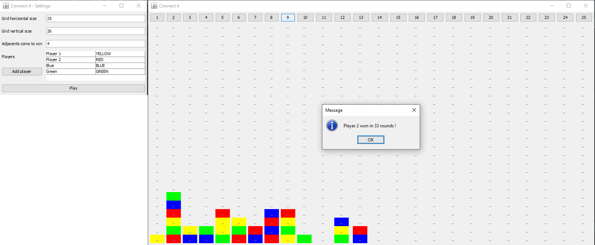

# Connect 4

An ("improved") Connect 4 game implementation in Java I made for fun.

## Features
- Customizable grid size (default is the normal version: 7x6)
- Customizable adjacents coins number needed to win
- Add more than 2 players

